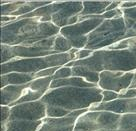
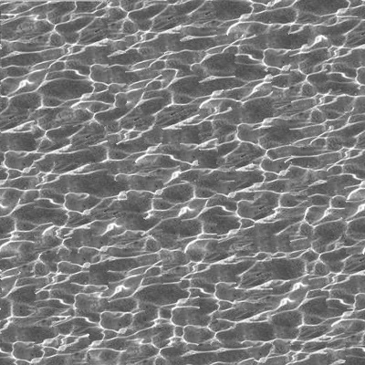

# Texture Synthesis

Image quilting based on image features.Combine small resolution images into large resolution images.

Add edge alignment that can be seamlessly attached to cylinder-like models.

## Result
### Input

### Output

## Reference
[Image Quilting for Texture Synthesis and Transfer.pdf](Image_Quilting_for_Texture_Synthesis_and_Transfer.pdf)